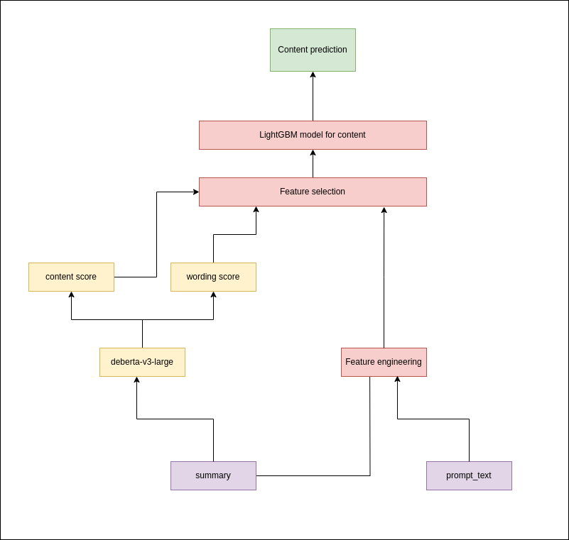
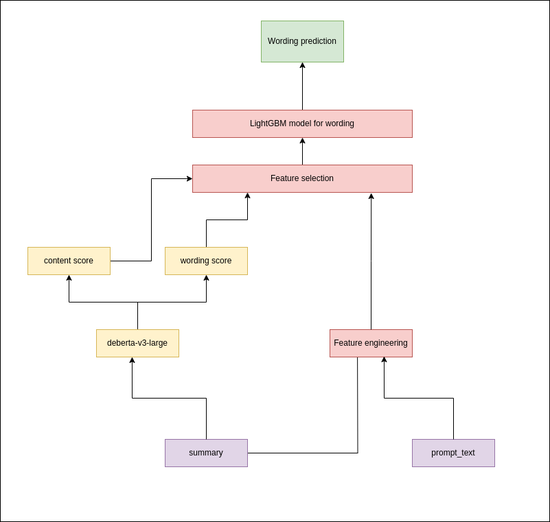
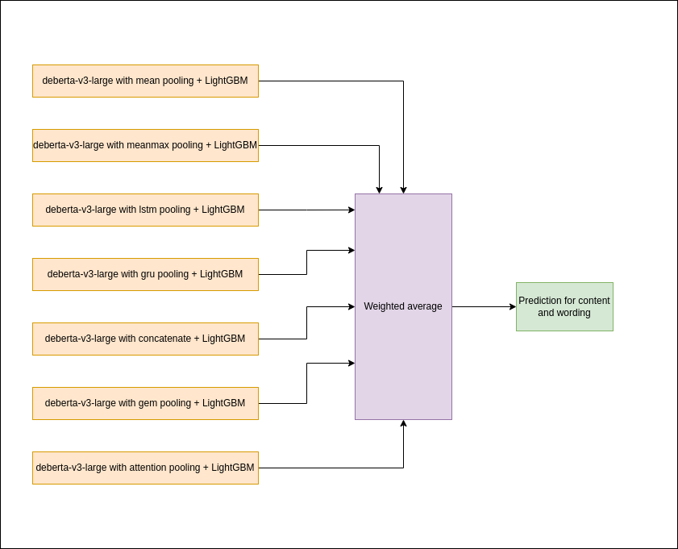
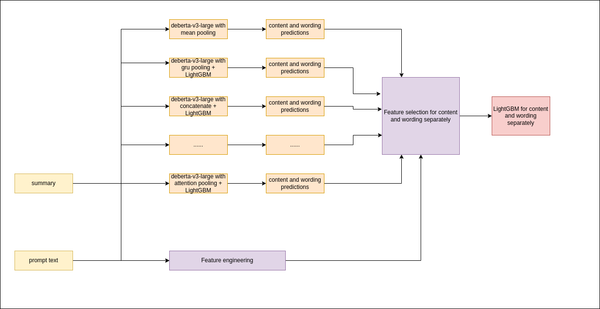

# CommonLit - Evaluate Student Summaries 51st place solution

## Description
Goal of the competition was to develop model which can be used to evaluate summaries written by English learners.

Details: https://www.kaggle.com/competitions/commonlit-evaluate-student-summaries/overview

## Metric
Metric used for scoring is MCRMSE (mean column wise root mean squared error)

Details: www.kaggle.com/competitions/commonlit-evaluate-student-summaries/overview/evaluation

## Solution approach

### Single model
Single model approach is based on combining deberta-v3-large with LightGBM. 

1. deberta-v3-large with pooling technique was trained using only text input (summary)
2. handcrafted features were created using text and prompt_text
3. to handcrafted features predictions for wording and content were added
4. feature selection and hyperparameter optimization were applied for LightGBM using created features in previous step

Deberta was trained to predict both content and wording score simultaneously. Separate LightGBM model was trained 
to predict content and wording scores. Feature selection and hyperparameter optimization for LightGBM were done by using optuna.

Diagrams below illustrate approach for content and wording model.
#### Content model



#### Wording model



In general, I trained several models for content and wording by changing pooling technique for deberta-v3-large 
with approach described above

|   | model                                                   |   CV   | Public LB  | Private LB  |
|---|:--------------------------------------------------------|:------:|:----------:|:-----------:|
| 1 | deberta-v3-large with mean pooling plus LightGBM        | 0.5131 |   0.456    |    0.505    |
| 2 | deberta-v3-large with attention pooling plus LightGBM   | 0.497  |   0.434    |    0.48     |
| 3 | deberta-v3-large with lstm pooling plus LightGBM        | 0.491  |   0.447    |    0.476    |
| 4 | deberta-v3-large with concatenate pooling plus LightGBM | 0.496  |   0.439    |    0.48     |
| 5 | deberta-v3-large with gem pooling plus LightGBM         | 0.5075 |   0.442    |    0.489    |
| 6 | deberta-v3-large with gru pooling plus LightGBM         |   -    |     -      |      -      |
| 7 | deberta-v3-large with meanmax pooling plus LightGBM     |   -    |     -      |      -      |

In two last models I was only interested in their effect on ensemble.

### Ensemble
Ensemble approach illustrated on diagram below



| models        |   CV   | Public LB | Private LB  | Selected as final submission |
|:--------------|:------:|:---------:|:-----------:|:----------------------------:|
| 1,2,3,4,5     | 0.4767 |   0.432   |    0.474    |             Yes              |
| 1,2,3,4,5,7   | 0.476  |   0.452   |    0.511    |              No              | 
| 1,2,3,4,5,6,7 | 0.4749 |   0.433   |    0.476    |              No              |

Selecting different models for ensemble for content and wording scores gives the following results:

| models wording | models content |   CV   | Public LB | Private LB  | Selected as final submission |
|:---------------|:---------------|:------:|:---------:|:-----------:|:----------------------------:|
| 2,4,3,7,6      | 4,5,1,6        | 0.4724 |   0.433   |    0.47     |             Yes              |

### Stacking deberta models via LightGBM

Another approach which I tried is to take predictions from deberta models listed above, add features based on summary and prompt text
and train single LightGBM model. 



| models        |   CV   | Public LB | Private LB  | Selected as final submission |
|:--------------|:------:|:---------:|:-----------:|:----------------------------:|
| 1,2,3,4,5     | 0.4817 |   0.439   |    0.469    |              No              |
| 1,2,3,4,5,6,7 | 0.4886 |   0.433   |    0.47     |             Yes              |

## Steps to reproduce

1. Clone repository
2. Install requirements
    ```bach
   pip3 install -r requirements.txt 
    ```
3. Download data from [competition data page](https://www.kaggle.com/competitions/commonlit-evaluate-student-summaries/data) 
and extract it into folder data_raw
4. Run jupyter notebook - notebooks/create_folds.ipynb
5. ```bash
   cp example.env .env
   ```
   replace WANDB_API_KEY with your own WANDB API KEY
6. Train deberta models with different poolings
   ```bash
   sh runners/db_l_conc_pool/run_all_folds.sh
   sh runners/db_l_gem_text/run_all_folds.sh
   sh runners/db_l_gru_pool/run_all_folds.sh
   sh runners/db_l_lstm_pool/run_all_folds.sh
   sh runners/db_l_meanmax_pool/run_all_folds.sh
   sh runners/db_large_attn_pool/run_all_folds.sh
   sh runners/deberta_large_with_frozen_embeddings_no_prompt_text/run_all_folds.sh
   ```
8. For each trained models - create oof predictions using jupyter notebook - notebooks/make_oof_predictions.ipynb
9. Train LightGBM models
   ```bash
   sh lgb_runners/attn_pool.sh
   sh lgb_runners/conc_pool.sh
   sh lgb_runners/gem_pool.sh
   sh lgb_runners/gru_pool.sh
   sh lgb_runners/lstm_pool.sh
   sh lgb_runners/mean_pool.sh
   sh lgb_runners/meanmax_pool.sh
   ```
10. Run notebook - notebooks/ensemble_of_lgbs.ipynb to create weights for ensembling
11. To stack deberta models by LightGBM run notebook - notebooks/stack_of_deberta_via_lgbm.ipynb


